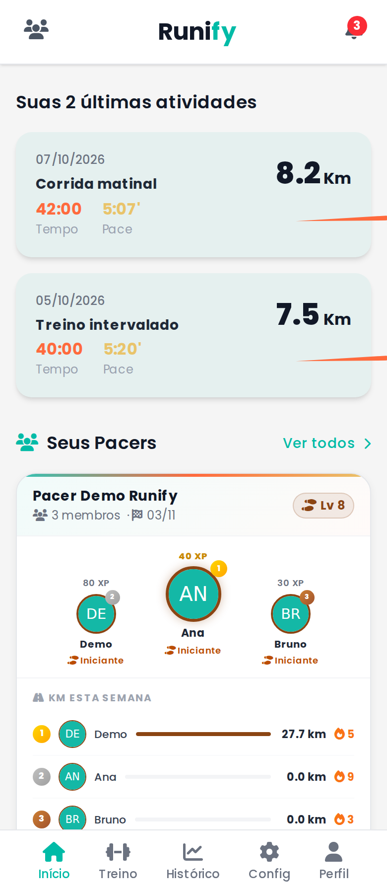
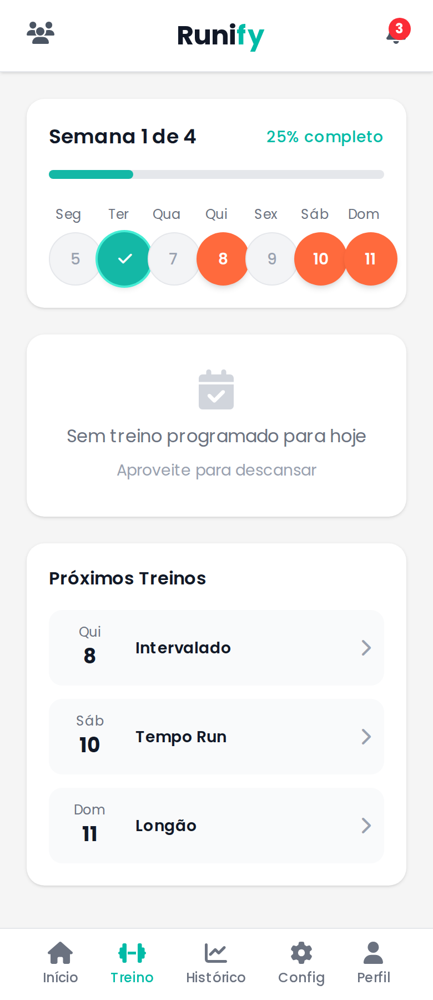
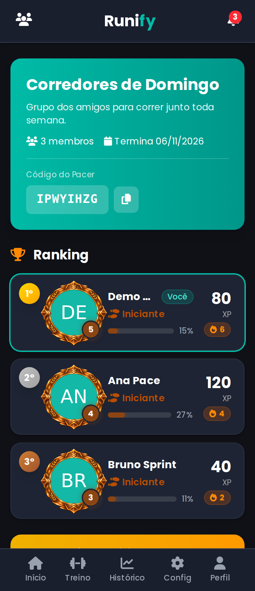
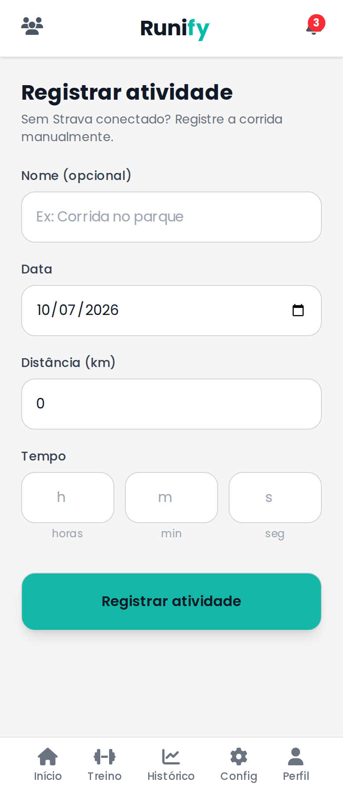
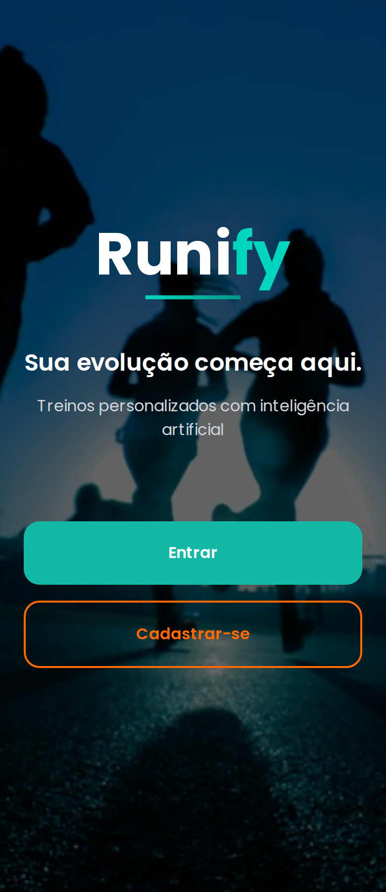
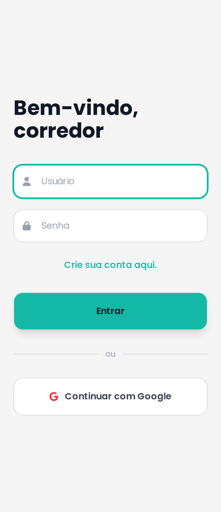
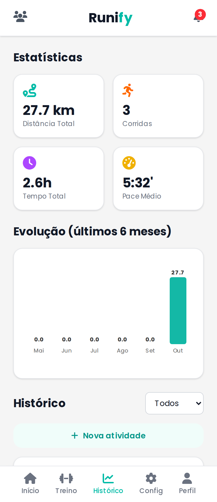
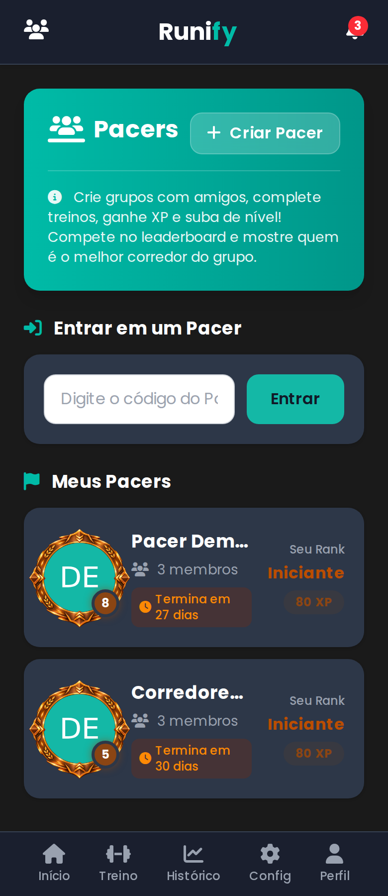
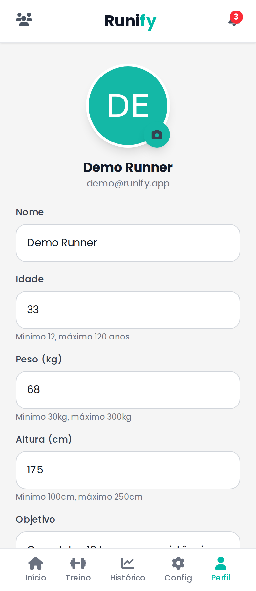

# Runify

Aplicativo web de treino para corredores amadores. O Runify gera um plano de
treino personalizado, acompanha a evolução do atleta e transforma o
condicionamento em algo social, com grupos (Pacers), ranking, XP e conquistas.

Projeto de Trabalho de Conclusão de Graduação, em uso real com participantes
para coleta de dados.

**Produção:** <https://runify.onrender.com>

<p align="center">
  
  
  
  
</p>

## Funcionalidades

- **Plano de treino com IA.** O plano é gerado pelo Gemini, mas os limites de
  distância, pace e volume semanal são calculados em Ruby a partir do perfil
  do atleta. Todo número passa por um validador e, se a IA falhar, entra um
  plano conservador determinístico. A IA nunca é autoridade sobre carga.
- **Ajuste semanal.** O plano é ajustado a partir do feedback dos treinos, no
  máximo uma vez por semana, com aumento limitado a 10% e redução a 20%.
- **Registro de atividades.** Registro manual de corridas, com histórico,
  pace e exportação dos próprios dados.
- **Integração com o Strava (opcional).** Conexão por OAuth e sincronização
  das últimas atividades, sujeita à cota de atletas do Strava.
- **Pacers.** Grupos de amigos entram por código, com ranking por nível e XP,
  quilometragem da semana e sequência de dias correndo.
- **XP, níveis e conquistas.** Só corridas contam (pedal, natação e caminhada
  ficam de fora).
- **Notificações** de treino do dia e resumo semanal.
- **Autenticação** por e-mail e senha ou Google, com aceite de Termos e
  Política de Privacidade (LGPD) e exclusão de conta.

## Telas

| Boas-vindas | Login | Início |
|:---:|:---:|:---:|
|  |  |  |

| Plano de treino | Registrar atividade | Histórico |
|:---:|:---:|:---:|
|  |  |  |

| Pacers | Ranking do Pacer | Perfil |
|:---:|:---:|:---:|
|  |  |  |

As capturas usam dados fictícios do seed de desenvolvimento.

## Stack

| Camada | Tecnologia |
|---|---|
| Aplicação | Ruby 3.4, Rails 8.1 (monólito, views server-rendered) |
| Front-end | Turbo, Stimulus, Tailwind CSS 4, importmap (sem Node/SPA) |
| Banco e jobs | PostgreSQL, Solid Queue, Solid Cache, Solid Cable |
| Autenticação | Devise, `omniauth-google-oauth2` |
| Integrações | Gemini (plano de treino), Strava (atividades) |
| Infra | Render (Docker), Cloudflare R2 (arquivos), Resend (e-mail), Sentry (erros) |
| Qualidade | Minitest, RuboCop, Brakeman, bundler-audit, GitHub Actions |

## Como rodar localmente

Pré-requisitos: Ruby 3.4 (versão em `.ruby-version`), Bundler e PostgreSQL.

1. Crie um `.env` na raiz com as chaves de desenvolvimento:

   ```env
   GEMINI_API_KEY=sua_chave_gemini
   STRAVA_CLIENT_ID=seu_client_id
   STRAVA_CLIENT_SECRET=seu_client_secret
   GOOGLE_CLIENT_ID=seu_client_id
   GOOGLE_CLIENT_SECRET=seu_client_secret
   POSTGRES_PASSWORD=sua_senha_postgres
   RUNIFY_DATABASE_PASSWORD=sua_senha_postgres
   ```

   Sem as chaves de Gemini, Strava e Google o app sobe, mas a geração de
   plano, a conexão com o Strava e o login com Google não funcionam.

2. Prepare o ambiente e suba o servidor:

   ```bash
   bin/setup        # ou bin/setup --skip-server
   bin/dev          # Rails + watcher do Tailwind, em http://localhost:3000
   ```

3. O seed cria contas de demonstração (`demo@runify.app`, senha
   `password1234`) com um plano e treinos de exemplo:

   ```bash
   bin/rails db:seed
   ```

## Testes e qualidade

```bash
bin/rails test      # testes
bin/ci              # RuboCop, audits, Brakeman, testes com piso de cobertura, seeds
```

O `bin/ci` executa o mesmo conjunto do GitHub Actions
(`.github/workflows/ci.yml`), incluindo o build de produção sem chaves
secretas, igual ao do Dockerfile.

## Deploy

O deploy é feito no Render a partir do `main`, com o serviço web em Docker
(`render.yaml`). O worker do Solid Queue roda dentro do processo do Puma
(`SOLID_QUEUE_IN_PUMA`). As variáveis de ambiente de produção ficam no painel
do Render e as chaves de criptografia no `credentials` do Rails.

## Arquitetura e documentação

- [`docs/architecture.md`](docs/architecture.md): fluxos e contratos dos
  service objects (Strava, geração de plano com IA, XP, notificações).
- [`docs/modelagem-banco-de-dados.md`](docs/modelagem-banco-de-dados.md):
  schema do banco, tabela por tabela, e as decisões de modelagem.
- [`docs/security.md`](docs/security.md): decisões e controles de segurança.
- [`docs/privacy.md`](docs/privacy.md): dados coletados e tratamento (LGPD).

## Estrutura

```
app/
  controllers/   fluxos de tela, Strava, Google, admin
  models/        User, Activity, TrainingPlan, Workout, Squad, ...
  services/      AiTrainingService, TrainingEnvelope, TrainingPlanValidator,
                 FallbackPlanBuilder, XpService, NotificationService
  jobs/          sincronização do Strava, análise semanal, lembretes
config/          rotas, initializers, agendamento (recurring.yml)
docs/            documentação técnica e capturas de tela
test/            Minitest com fixtures
```
