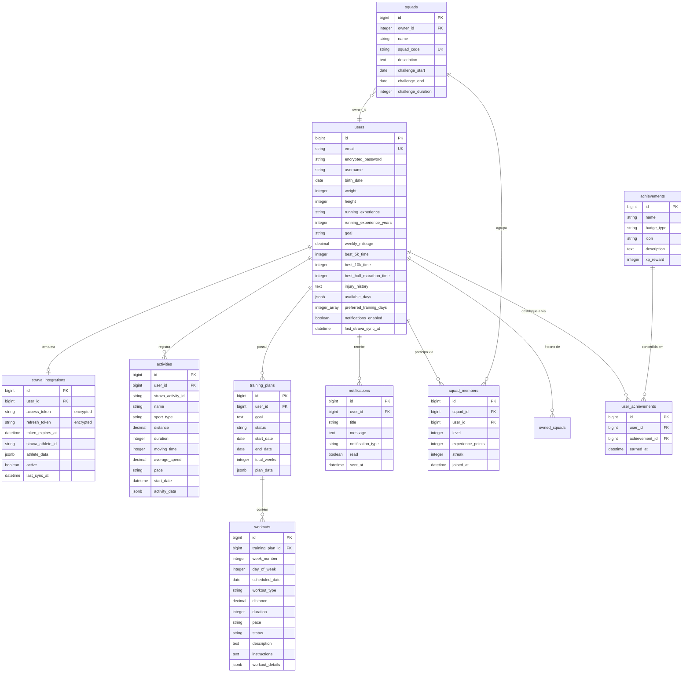

# Modelagem do Banco de Dados — Runify

> Documento técnico de apoio ao Trabalho de Graduação.
> Gerado a partir do esquema real do sistema (`db/schema.rb`, versão `2026_05_22_000001`) e dos modelos ActiveRecord.

---

## 1. Visão geral

O **Runify** é um monólito Rails 8.1 voltado para corredores. O banco de dados sustenta quatro grandes domínios funcionais:

1. **Identidade e perfil do corredor** — quem é o usuário, suas medidas físicas, experiência e metas.
2. **Integração e ingestão de dados externos** — conexão com o Strava e os treinos importados.
3. **Planejamento de treino com IA** — planos gerados por IA e as sessões (workouts) que os compõem.
4. **Social e gamificação** — squads (grupos), ranking por XP/nível, conquistas e notificações.

### SGBD e tecnologia

| Item | Decisão |
|------|---------|
| Banco | **PostgreSQL** |
| ORM | **ActiveRecord** (Rails 8.1), padrão *convention over configuration* |
| Tipos especiais | `jsonb` para dados semiestruturados, `array` nativo do Postgres, `decimal` com precisão definida |
| Migrations | 18 migrations versionadas em `db/migrate/` — o esquema é evolutivo e rastreável |
| Criptografia | ActiveRecord Encryption nos tokens do Strava |

### Por que esse desenho?

O banco segue dois princípios que convivem deliberadamente:

- **Normalização nas entidades estáveis** — usuário, plano, treino, squad e conquistas têm colunas fortemente tipadas, com chaves estrangeiras e índices. É o "núcleo relacional".
- **Desnormalização controlada via JSONB** nas fronteiras com dados externos ou variáveis — o payload bruto do Strava (`activity_data`), a estrutura do plano gerado pela IA (`plan_data`) e os detalhes de cada treino (`workout_details`). Isso evita criar dezenas de colunas para campos que mudam conforme a fonte (Strava) ou o modelo de IA, mantendo flexibilidade sem perder o que é consultável (os campos "normalizados" ficam fora do JSON).

Esse híbrido é o ponto central da modelagem e deve ser destacado no TG: **o que é consultado e filtrado vira coluna; o que é apenas armazenado/exibido vira JSONB.**

---

## 2. Diagrama Entidade-Relacionamento (ER)



> **Legenda de cardinalidade (notação crow's foot):** `||` = exatamente um, `o|` = zero ou um, `o{` = zero ou muitos.

---

## 3. Mapa de relacionamentos

O **`User` é o agregador central** do domínio — quase tudo pende dele.

| Origem | Relação | Destino | Cardinalidade | Observação |
|--------|---------|---------|---------------|------------|
| User | `has_one` | StravaIntegration | 1 : 0..1 | `dependent: :destroy` |
| User | `has_many` | Activity | 1 : N | `dependent: :destroy` |
| User | `has_many` | TrainingPlan | 1 : N | `dependent: :destroy` |
| User | `has_many` | Notification | 1 : N | `dependent: :destroy` |
| User | `has_many` | SquadMember | 1 : N | tabela de junção rica |
| User | `has_many :through` | Squad | N : N | via `squad_members` |
| User | `has_many` | Squad (`owned_squads`) | 1 : N | papel de **dono** via `owner_id` |
| User | `has_many :through` | Achievement | N : N | via `user_achievements` |
| TrainingPlan | `has_many` | Workout | 1 : N | `dependent: :destroy` |
| Squad | `has_many` | SquadMember | 1 : N | `dependent: :destroy` |
| Squad | `belongs_to` | User (`owner`) | N : 1 | dono do grupo |

### Os dois relacionamentos N:N

1. **User ↔ Squad** através de `squad_members`. Esta é uma **tabela de junção "rica"**: além das chaves estrangeiras, ela carrega atributos próprios da participação — `level`, `experience_points`, `streak` e `joined_at`. Ou seja, o progresso de gamificação é **por squad, não por usuário global**. Um índice único em `(squad_id, user_id)` impede participação duplicada.

2. **User ↔ Achievement** através de `user_achievements`, junção mais simples, registrando apenas *quando* (`earned_at`) a conquista foi obtida. Índice único em `(user_id, achievement_id)` garante que a mesma conquista não seja concedida duas vezes.

### Duplo papel do usuário sobre o Squad

O `Squad` se relaciona com `User` de **duas formas distintas**:
- como **membro** (via `squad_members`, N:N);
- como **dono** (via coluna `owner_id`, 1:N — `Squad belongs_to :owner`).

Isso permite saber quem criou/administra o grupo separadamente de quem apenas participa.

---

## 4. Detalhamento por tabela

### 4.1 `users` — núcleo de identidade e perfil

Autenticação gerenciada pelo **Devise** (módulos `database_authenticatable`, `registerable`, `recoverable`, `rememberable`, `validatable`).

**Campos de identidade/autenticação:** `email` (único, NOT NULL), `encrypted_password`, `username`, `reset_password_token` (único), `remember_created_at`.

**Campos de perfil físico/esportivo:**
- `birth_date` — a idade é **calculada** (método `age`), não armazenada, evitando dado defasado.
- `weight`, `height` — com validações de faixa (30–300 kg, 100–250 cm).
- `running_experience` — enum textual validado (`beginner`/`intermediate`/`advanced`).
- `running_experience_years`, `weekly_mileage`.
- `best_5k_time`, `best_10k_time`, `best_half_marathon_time` — recordes pessoais **em segundos** (integer), o que facilita cálculos (ex.: estimativa de VO₂máx no método `estimated_vo2_max`).
- `injury_history` (texto livre), `goal` (validado até 500 caracteres).

**Campos de preferências/agenda:**
- `available_days` (**jsonb**) e `preferred_training_days` (**array de inteiros**) — duas estratégias de armazenamento de disponibilidade semanal, alimentando o gerador de plano de IA.
- `notifications_enabled` (boolean), `last_strava_sync_at`.

**Métodos de negócio relevantes (lógica que mora no modelo, não no banco):** `strava_connected?`, `active_training_plan`, `age`, `estimated_vo2_max`, `average_recent_pace`, `level`/`experience_points` (delegados ao `primary_squad_member`).

**Índices:** únicos em `email` e `reset_password_token`.

---

### 4.2 `strava_integrations` — conexão OAuth com o Strava

Relação 1:1 com o usuário. Guarda as credenciais OAuth e o ciclo de vida do token.

- `access_token` e `refresh_token` — **criptografados em repouso** via `encrypts` do ActiveRecord (o `access_token` é determinístico para permitir busca; o `refresh_token` não). Decisão importante de **segurança** para o TG: tokens de terceiros nunca ficam em texto puro.
- `token_expires_at` — habilita a renovação proativa. O modelo implementa `token_expired?`, `token_needs_refresh?` (com buffer de 1 minuto) e `refresh_token!`, que chama a API OAuth do Strava e persiste o novo par de tokens.
- `strava_athlete_id` — identificador do atleta no Strava, com validação de **unicidade** (uma conta Strava não pode ligar-se a dois usuários Runify).
- `athlete_data` (**jsonb**) — perfil bruto retornado pelo Strava.
- `active`, `last_sync_at`.

**Índices:** em `user_id` e `strava_athlete_id`.

---

### 4.3 `activities` — treinos importados do Strava

Cada linha é um treino sincronizado. Exemplo clássico do híbrido **normalizado + JSONB**:

- **Campos normalizados** (consultáveis/filtráveis): `name`, `sport_type`, `distance` (decimal 8,2), `duration`, `moving_time`, `average_speed` (decimal 5,2), `pace`, `start_date`.
- **`activity_data` (jsonb)** — payload completo do Strava, preservado para auditoria/uso futuro sem inflar o esquema.
- `strava_activity_id` — id do treino na origem.

**Lógica derivada no modelo:** `distance_km`, `duration_formatted`, `pace_per_km` (calcula ritmo a partir de `moving_time` e `distance`).

**Índices (decisões de performance):**
- Único composto em `(user_id, strava_activity_id)` — **idempotência da sincronização**: reimportar não duplica treinos.
- Em `start_date` — ordenação cronológica (timeline, "atividades recentes").
- Em `user_id` — busca por usuário.

---

### 4.4 `training_plans` — planos de treino gerados por IA

Plano macro que pertence a um usuário e agrupa os workouts.

- `goal` (texto), `start_date`, `end_date`, `total_weeks`.
- `status` — máquina de estados validada: `active` / `completed` / `cancelled` (default `active`).
- `plan_data` (**jsonb**) — estrutura completa devolvida pela IA (Gemini).

**Lógica no modelo:** `current_week` (calcula a semana atual a partir da segunda-feira da semana de `start_date`), `current_week_workouts`, `active?`/`completed?`, scope `active`.

**Índices:** `user_id`, `status`, `start_date`.

---

### 4.5 `workouts` — sessões individuais do plano

Filha de `training_plans` (1:N). Representa um treino agendado.

- Posicionamento temporal: `week_number`, `day_of_week`, `scheduled_date`.
- Prescrição: `workout_type`, `distance` (decimal 8,2), `duration`, `pace`, `description`, `instructions`.
- `status` — validado: `pending` / `completed` / `skipped` (default `pending`).
- `workout_details` (**jsonb**) — detalhes estruturados (séries, intervalos etc.).

**Lógica no modelo:** scopes `pending`/`completed`/`for_date`, e transições `mark_as_completed!` / `mark_as_skipped!`.

**Índices:** `training_plan_id`, `status`, `scheduled_date`, e composto `(training_plan_id, week_number)` — consulta típica "treinos da semana X do plano".

---

### 4.6 `squads` + `squad_members` — grupos sociais e gamificação

**`squads`** — o grupo/desafio:
- `name` (NOT NULL), `description`.
- `squad_code` — código único de convite, **gerado automaticamente** antes da validação (`SecureRandom.alphanumeric(8).upcase`).
- `owner_id` — dono.
- `challenge_start`, `challenge_end`, `challenge_duration` — janela do desafio. `active?` compara `challenge_end` com a data atual.
- `leaderboard` ordena membros por XP e nível.

**`squad_members`** — junção rica (já descrita na seção 3):
- `level` (default 1), `experience_points` (default 0), `streak` (default 0), `joined_at`.
- Lógica de **progressão**: `add_xp` acumula XP e chama `check_level_up`, que sobe de nível enquanto o XP atingir `xp_for_next_level` (`level * 100 + 50`).
- Sistema de **tiers visuais** por faixa de nível (`bronze_runner` → `mythic_immortal`), com cores, bordas e animações — recurso de UI dirigido por dados do banco.

**Índices:** `squads` tem índice único em `squad_code`; `squad_members` tem índice único `(squad_id, user_id)` e índices em `level` e `experience_points` (para ranking).

---

### 4.7 `achievements` + `user_achievements` — sistema de conquistas

- **`achievements`** — catálogo de conquistas: `name` (NOT NULL), `badge_type`, `icon`, `description`, `xp_reward` (default 0). Índice em `badge_type`.
- **`user_achievements`** — junção que registra a conquista obtida por um usuário e *quando* (`earned_at`). Índice único `(user_id, achievement_id)`.

> Observação técnica para o TG: o modelo `Achievement` não declara explicitamente `has_many :user_achievements`, embora o lado `User` use a associação `has_many :through`. Não impede o funcionamento da junção a partir do usuário, mas é um ponto de assimetria a documentar.

---

### 4.8 `notifications` — notificações ao usuário

- `title`, `message`, `notification_type` (validado: `workout_reminder` / `sync_reminder` / `congratulations` / `weekly_summary`), `read` (default false), `sent_at`.
- Scopes `unread` e `recent`; método `mark_as_read!`.
- **Índices:** `user_id`, `notification_type`, `read`, `sent_at` — suportam filtros por status e tipo.

---

### 4.9 Tabelas internas do Active Storage

`active_storage_attachments`, `active_storage_blobs` e `active_storage_variant_records` são geradas pelo framework para anexos de arquivo. No domínio do Runify, sustentam o **avatar** do usuário (`has_one_attached :avatar`). Não fazem parte da modelagem de negócio, mas constam no esquema.

---

## 5. Decisões de modelagem — síntese para defesa

| Decisão | Justificativa |
|---------|---------------|
| **PostgreSQL + JSONB** | Combina rigidez relacional onde há consulta com flexibilidade onde há dado externo/variável (Strava, IA). |
| **Campos normalizados ao lado do JSONB bruto** | Permite filtrar/ordenar por distância, data, ritmo sem parsear JSON, mantendo o payload original íntegro. |
| **Tempos de recorde em segundos (integer)** | Facilita cálculos (VO₂máx, comparações) e evita ambiguidade de formato. |
| **Idade calculada, não armazenada** | Evita dado que envelhece e precisa de atualização. |
| **Junção rica `squad_members`** | Gamificação é por grupo; XP/nível/streak são atributos da *participação*, não do usuário. |
| **Índices únicos compostos** | Garantem regras de negócio no nível do banco: sincronização idempotente, sem membro/conquista duplicados. |
| **Criptografia de tokens OAuth** | Segurança: credenciais de terceiros nunca em texto puro. |
| **`dependent: :destroy` em cascata** | Integridade referencial: remover usuário limpa todo o seu rastro (atividades, planos, integrações etc.). |
| **`status` como string validada** | Máquinas de estado simples (plano e treino) sem tabela auxiliar de status. |
| **Migrations versionadas** | Evolução do esquema rastreável e reproduzível. |

---

## 6. Fluxos que atravessam o modelo

1. **Onboarding** → cria `users`, preenche perfil físico/preferências.
2. **Conexão Strava** → `StravaController` cria `strava_integrations` (tokens criptografados) → `SyncStravaActivitiesJob` popula `activities` (idempotente pelo índice único).
3. **Geração de plano** → `AiTrainingService` lê perfil + 10 atividades recentes, chama o Gemini e grava `training_plans` + N `workouts`.
4. **Acompanhamento** → usuário marca workouts (`pending`→`completed`/`skipped`); `AiAdjustmentService` ajusta treinos futuros.
5. **Social/gamificação** → entra em `squads` (cria `squad_members`), acumula XP/nível, desbloqueia `achievements` (`user_achievements`), recebe `notifications`.

---

## 7. Resumo de cardinalidades (referência rápida)

```
User 1 ── 0..1 StravaIntegration
User 1 ── N    Activity
User 1 ── N    TrainingPlan ── N Workout
User 1 ── N    Notification
User N ── N    Squad        (via SquadMember, junção rica)
User 1 ── N    Squad        (como owner)
User N ── N    Achievement  (via UserAchievement)
```
